# Cloud Logging Architecture And AWS/GCP Walkthrough

## Purpose

This document uses `MCTC-LOG-01` to show how one provider-neutral control objective becomes different AWS and Google Cloud evidence paths.

The objective is not merely to prove that a logging feature is enabled. A reviewer needs evidence that expected events are generated, routed, protected, retained, delivered, and queryable.

All names, scopes, findings, and resource references in this project are synthetic. The diagram describes an evidence-review model, not a deployed production environment.

## Architecture

The editable Mermaid source is committed at [`assets/cloud_logging_architecture.mmd`](assets/cloud_logging_architecture.mmd).

The common boundary begins at normalized evidence. Provider APIs and configuration details differ, but every record still carries a provider, scope, environment, source system, collection method, collection date, owner, status, and summary.

## Same Objective, Different Mechanisms

| Review concern | AWS | Google Cloud | Evidence question |
|---|---|---|---|
| Organization coverage | Multi-Region CloudTrail organization trail | Organization-level audit configuration and aggregated sink with child-resource coverage | Are new and existing accounts/projects included without manual per-resource setup? |
| Administrative activity | Read and write management events | Admin Activity and System Event audit logs | Are configuration and control-plane changes recorded? |
| Data access | Data events selected by resource type | Data Access permission types enabled by service or inherited default | Which high-risk data operations must be recorded, and what volume/cost follows? |
| Denied activity | Relevant authorization failures in CloudTrail events and downstream detections | Policy Denied audit logs | Can investigators see blocked actions as well as successful changes? |
| Central routing | CloudTrail delivery to S3 and optional CloudWatch Logs/SIEM path | Non-intercepting aggregated Log Router sink | Does centralization preserve expected local routing and avoid unsafe exclusions? |
| Destination authorization | S3 bucket policy and KMS policy restricted to the trail | Sink writer identity granted only the required destination role | Can the service write, and is the destination protected from unrelated writers? |
| Retention | S3 lifecycle, versioning, and optional stronger deletion protection | Logging bucket retention, optional irreversible lock, and project protection | Does retention meet policy, and can privileged users or project deletion bypass the intent? |
| Integrity | CloudTrail log-file validation and protected digest files | Immutable audit entries plus locked destination retention where required | What proves stored evidence was not casually altered or removed? |
| Encryption | S3 encryption with an appropriate KMS policy | Google-managed encryption or CMEK where the threat model requires it | Who controls keys, and could key loss or policy failure interrupt logging? |
| Delivery health | Trail status, delivery errors, CloudWatch/SIEM freshness | Log Router export metrics, sink errors, and destination freshness | Is configuration present but delivery silently failing? |
| Queryability | Saved CloudTrail/SIEM query with useful investigation fields | Logs Explorer or analytics query scoped to the central log view | Can a reviewer retrieve a recent known event with actor, resource, source, and time? |

## Important Provider Caveats

### AWS

- CloudTrail event history is useful for recent management-event lookup, but it is regional, account-scoped, and limited to 90 days. It is not a substitute for a durable organization trail.
- A multi-Region organization trail reduces onboarding gaps, but event selectors still determine whether required management and data activity is captured.
- Log-file validation detects modification or deletion after delivery; it does not prevent deletion by itself.
- A private encrypted bucket can still have inadequate retention. Configuration, protection, and lifecycle evidence must be reviewed separately.
- Data events can materially increase volume and cost, so selection should follow risk rather than a blanket enable-everything rule.

### Google Cloud

- Admin Activity and System Event audit logs are always written. Most Data Access logs, except BigQuery, require explicit configuration and can materially increase volume and cost.
- An aggregated sink needs child-resource coverage, correct filters, a valid destination, and destination IAM for its unique writer identity.
- A non-intercepting sink creates a central copy while preserving child-resource routing. An intercepting sink changes downstream routing behavior and needs a deliberate reason.
- Sink creation and configuration changes are not retroactive. Delivery must be tested with new matching events.
- A locked Logging bucket makes its retention policy irreversible. The decision should be reviewed before locking, and a project lien may be needed if deletion of the parent project is also in scope.
- Complete provider coverage does not mean a passing review. This project has GCP evidence present while still reporting incomplete `DATA_READ` coverage as `needs_review`.

## How To Reason Through The Design

Use five questions in order:

1. **Generation:** Which administrative, data, denied, and system activities must exist as logs?
2. **Scope:** Which organizations, accounts, folders, projects, Regions, services, and new resources must inherit coverage?
3. **Routing and storage:** Where are logs copied, who can write or read them, and which filters or exclusions apply?
4. **Protection and retention:** How long are logs retained, what prevents casual deletion, and what key or project failures could make them unavailable?
5. **Observed behavior:** Can monitoring prove delivery health, and can a reviewer retrieve a recent known event from the intended destination?

This order avoids a common failure: treating an enabled service or successfully created sink as proof that usable audit evidence exists.

## Trade-Offs To Say Out Loud

- More event coverage improves investigation depth but increases ingestion, storage, and analysis cost.
- Centralization improves review and correlation but creates a high-value destination requiring strict access and resilient key management.
- Strong retention locks reduce deletion risk but also reduce operational flexibility and can make mistakes expensive.
- Provider-native storage is simpler; forwarding to a common SIEM improves correlation but adds another permission, delivery, and cost boundary.
- A shared control objective improves governance consistency, while provider-specific evidence preserves technical truth.

## Concise Interview Walkthrough

> I start with the evidence outcome rather than assuming CloudTrail and Cloud Audit Logs are interchangeable. In AWS I would verify an organization-wide multi-Region trail, event selectors, protected S3 delivery, validation, retention, and a recent query. In Google Cloud I would verify the audit configuration, Data Access choices, an organization aggregated sink, writer permissions, locked retention where justified, export health, and a central query. I normalize the review result, not the provider API. I also keep coverage separate from status: having GCP evidence does not make it pass if an important service is still missing Data Access coverage.

## Current Boundaries

- No live cloud collectors are included yet.
- No claim is made that one retention period or Data Access policy fits every organization.
- The examples do not establish official SOC 2, ISO 27001, NIST, PCI DSS, or regulatory compliance.
- Real implementation requires threat modeling, legal and retention requirements, data residency decisions, expected event volume, and tested recovery procedures.

## Official References

AWS:

- [CloudTrail concepts](https://docs.aws.amazon.com/awscloudtrail/latest/userguide/cloudtrail-concepts.html)
- [CloudTrail data protection](https://docs.aws.amazon.com/awscloudtrail/latest/userguide/data-protection.html)
- [Validate CloudTrail log-file integrity](https://docs.aws.amazon.com/awscloudtrail/latest/userguide/cloudtrail-log-file-validation-intro.html)
- [Security Hub CloudTrail controls](https://docs.aws.amazon.com/securityhub/latest/userguide/cloudtrail-controls.html)
- [Monitor CloudTrail with CloudWatch Logs](https://docs.aws.amazon.com/awscloudtrail/latest/userguide/monitor-cloudtrail-log-files-with-cloudwatch-logs.html)

Google Cloud:

- [Cloud Audit Logs overview](https://docs.cloud.google.com/logging/docs/audit)
- [Cloud Audit Logs best practices](https://docs.cloud.google.com/logging/docs/audit/best-practices)
- [Configure Data Access audit logs](https://docs.cloud.google.com/logging/docs/audit/configure-data-access)
- [Route log entries](https://docs.cloud.google.com/logging/docs/routing/overview)
- [Aggregated sinks](https://docs.cloud.google.com/logging/docs/export/aggregated_sinks)
- [Configure log buckets](https://docs.cloud.google.com/logging/docs/buckets)
- [Troubleshoot routing and storage](https://cloud.google.com/logging/docs/export/troubleshoot)
